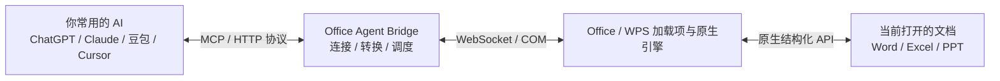

# Office Agent Bridge

> **让你正在使用的 AI，真正会用 Office**  
> 看懂当前文件，直接操作当前文档，当场完成你的要求。

[](LICENSE)
[](package.json)
[](package.json)
[](src/bridge/AGENTS.md)

ChatGPT、Claude、豆包、千问等大模型已经足够聪明。它们会分析、会写作、会理解复杂需求。但在面对 Office 时，大多数 AI 仍然停留在：**帮你想、教你怎么做，或者重新生成一个新文件**。落到 Word、Excel、PPT 里的最后一步，往往还是人自己完成。

**Office Agent Bridge 做的事情很简单**：
> **给现有 AI 增加一层真正的 Office 原生操作能力。**

让 AI 不再只是隔空处理“文件”，而是直接接入你当前正在使用的 Office 桌面工作区。它可以读取当前文档、理解当前状态，并通过 Office / WPS 原生结构化能力直接完成修改。

---

## 核心区别：不是重新做文件，而是操作运行中的工作区

现在很多 AI Office 工具的工作方式本质上是**文件处理**：


**Office Agent Bridge 走的是实时工作区操作路线**：


- **传统方式操作的是**：**文件**（推倒重来，覆盖历史样式与宏）。
- **Office Agent Bridge 操作的是**：**正在运行的 Office 应用程序本身**（在已有成果上指哪改哪）。

---

## 它不是另一个 AI

Office Agent Bridge 本身不替代你习惯的大模型，它是 AI 与 Office 之间的**实时执行基础设施**：

- **AI 负责思考**：理解意图、分析逻辑、制定步骤。
- **Office Agent Bridge 负责连接与调度**：桥接协议、会话管理、意图转译、安全审计。
- **Office / WPS 负责执行**：调用原生结构化 API 操作文档、反馈实时状态。



---

## 普通 AI 接入前后的对比

| 维度 | 普通 AI 工具 | 接入 Office Agent Bridge |
|---|---|---|
| **交互模式** | 告诉你怎么做，自己复制粘贴 | **直接当场执行完成** |
| **操作对象** | 离线上载的静态文件 | **当前桌面打开的实时文件** |
| **产出方式** | 全盘重写重新生成 | **保留已有格式与结构，局部精细修改** |
| **操作粒度** | 粗粒度整篇替换 | **精确定位到特定单元格、段落、形状或页面** |
| **协同方式** | AI 与 Office 完全脱节 | **AI 与人在同一工作区无缝协作** |
| **执行反馈** | 黑盒执行，只看最终文件 | **修改过程毫秒级呈现在屏幕前** |
| **交互连续性** | 一次性交付，错了重来 | **边看、边做、随时打断与纠偏** |

---

## 为什么它比传统方案更可靠

### 1. 为什么比视觉 GUI Agent（模拟鼠标）更精准
视觉 Agent 依靠截图、目标检测定位屏幕坐标，容易受屏幕分辨率、多显示器缩放、界面遮挡、弹窗及加载抖动影响。  
Office Agent Bridge 直连宿主**结构化接口**：AI 面对的是具体的 `Sheet1!H23`、`图表 2`、`第 12 页`，实现**零漂移、高确定性的代码级修改**。

### 2. 为什么比 openpyxl 等纯脚本方案更实用
`openpyxl` 是 **File Automation**（离线修改文件，文件被 Office 占用时会报冲突，且无法处理动态计算与即时交互）。  
Office Agent Bridge 是 **Application Automation**，直连活体进程，修改直接反映在打开的界面上，实时可用。

### 3. 双向实时执行环（Observe → Reason → Act → Observe）
不仅能写，还能读：


---

## 典型场景：月度经营复盘

已有维护了 7 个月的月度经营复盘 Excel（内含精细公式、复杂图表与历史数据）以及汇报 PPT：
> **你对 AI 说**：“把 8 月数据填入，按原有逻辑更新趋势图，未达标指标标红，再把结论同步更新到 PPT 第 12 页。”

- **AI 通过 Bridge**：
  1. 读取当前活页与现有数据区间结构；
  2. 沿用现有统计逻辑在末尾追加 8 月数据；
  3. 刷新现有图表的数据系列（保留所有配色与样式）；
  4. 触发异常指标高亮；
  5. 更新当前打开的 PPT 对应页面。
- 过程中你可以随时指示：“标记不要用红色，换浅橙色” —— **AI 当场微调，无需重新上传或推倒重做**。

---

## 当前支持范围

| 宿主 | 实现方式 | 验证状态 |
|---|---|---|
| **macOS WPS** | 官方加载项、结构化表格工具、Word/PPT 基础工具 | 核心服务与测试通过，持续回归新加载项 |
| **Windows WPS** | 加载项安装分支及同一工具协议 | 待 Windows 实机全面验收 |
| **Windows Microsoft Excel** | PowerShell COM 结构化表格适配 | 代码已就绪，支持原生 Excel 自动化 |
| **macOS Microsoft Office** | JXA 原生脚本与状态通道 | 结构化 Excel 适配暂不支持 |
| **Microsoft Word / PPT** | 原生脚本、PowerPoint 实时预览 | 支持基础读取与元素编辑，高保真复刻待持续迭代 |

> [!NOTE]
> PPT 目前适合基础读取、文字、形状、表格和页面管理；复杂嵌入图表对象、母版高级定制及复杂动画暂不作全量支持承诺。

---

## 架构与运行方式

```text
桌面管理器 ─┐
stdio MCP ──┼─ 本机认证 HTTP / MCP ─ 独立 Bridge 后台
HTTP MCP ───┘                           ├─ WPS 加载项 WebSocket
                                      └─ Windows Office COM / macOS JXA
```

- **独立后台运行**：桌面管理器关闭后后台服务仍可保持常驻。
- **多客户端复用**：stdio MCP 会自动启动或接入已存在的 Bridge 后台；单个 AI 会话断开不影响其他连接。
- **安全与权限边界**：服务仅监听 `127.0.0.1` 本地回环接口，全部 HTTP、WebSocket 均须校验本地安装凭证；单元格更新提供快照回滚能力。

---

## 快速上手

### 环境要求
- Node.js 22 LTS 或更高版本
- 本地已安装 WPS Office 或 Microsoft Office

### 源码安装与启动

```sh
# 1. 安装依赖
npm ci

# 2. 类型检查与构建
npm run typecheck
npm run build

# 3. 启动桌面管理器
npm start
```

1. 在桌面管理器中点击**“安装 / 修复加载项”**，随后重启一次 WPS 即可自动加载 Bridge 插件。
2. 在**“AI 接入”**面板勾选你要接入的 AI 客户端（如 Claude Desktop、Cursor、Cline 等），一键生成 MCP 配置。

### 命令行 / CLI 运维

```sh
node dist/bridge/cli.cjs --start          # 后台启动服务
node dist/bridge/cli.cjs --status         # 检查运行状态
node dist/bridge/cli.cjs --doctor         # 连接诊断
node dist/bridge/cli.cjs --repair-addon    # 修复/重新部署加载项
node dist/bridge/cli.cjs --stop           # 停止服务
```

> 不带任何参数直接运行 `cli.cjs` 即作为 **stdio MCP 服务器**，供各大支持 MCP 的智能体直接作为子进程拉起。

---

## 技能与工具体系

- **MCP 工具规范**：表格工具统一采用 `excel_*` 命名规范（需传递 `host: "wps" | "microsoft"`）；旧版 `wps_*` 兼容保留。
- **配套 Agent 技能**：位于 [skills/office-agent-bridge](skills/office-agent-bridge/SKILL.md)，包含标准调用规范、容错降级及最佳实践。接入后建议引导 Agent 首选调用 `bridge_get_capabilities` 确认可用能力。

---

## 验证与发布

```sh
# 运行自动化测试套件
npm test

# 检查各模块导航与文档结构
npm run check:agents

# 跨平台构建打包
npm run dist
```

打包构建产物将输出在 `release/<版本>/<平台>/` 目录中。

---

## 参与贡献与开发导航

本项目采用模块化协作规范，在开发前建议首读 [AGENTS.md](AGENTS.md) 了解模块边界：
- **MCP 路由与工具契约**：参见 [src/bridge/AGENTS.md](src/bridge/AGENTS.md)
- **WPS 加载项开发**：参见 [wps-addon/AGENTS.md](wps-addon/AGENTS.md)
- **Office.js 插件**：参见 [office-addon/AGENTS.md](office-addon/AGENTS.md)
- **Windows 原生自动化**：参见 [resources/office/AGENTS.md](resources/office/AGENTS.md)
- **桌面 GUI 界面**：参见 [src/renderer/AGENTS.md](src/renderer/AGENTS.md)

---

## 许可证 (License)

本项目采用 [MIT License](LICENSE) 开源协议。
