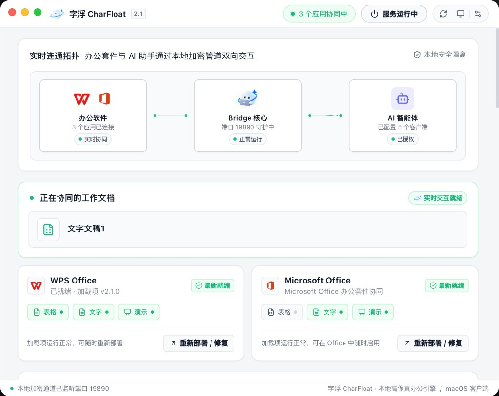
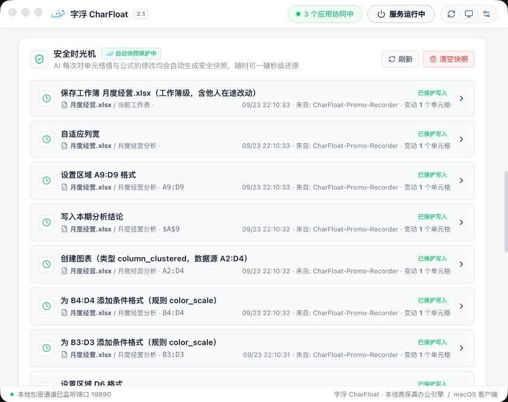

<div align="center">
  
  <h1>字浮 CharFloat</h1>
  <p><strong>给你的 AI 开个 Office 外挂</strong>。你说，它当场改。</p>
  <p>
    <b>不用上传下载</b> · 
    <b>不另存多余副本</b> · 
    <b>原文档增量修改</b> · 
    <b>改到哪儿看到哪儿</b>
  </p>
  <p><em>ChatGPT、WorkBuddy、豆包、千问……你用谁都行。装上字浮，让它们直接进入当前正打开的 WPS 与 Excel，就在眼前这一份里跟你一起改完。</em></p>
</div>

<p align="center">
  <a href="LICENSE"></a>
  <a href="package.json"></a>
  <a href="package.json"></a>
  <a href="package.json"></a>
  <a href="package.json"></a>
  
</p>

<p align="center">
  
</p>

> 关于「**字浮 CharFloat**」：
> - **字浮 ≈ 字符**：中文读音天然顺口，自然好记。
> - **Char + Float**：英文自然拆解为 Character（字符）与 Float（漂浮），皆为熟悉的经典术语。
> - **云朵形象**：浮空云朵与品牌相扣，代表轻盈、无感进驻桌面。
> - **开放延伸**：不把能力局限在单一工具，未来作为 AI 扩展至更多桌面软件的原生桥梁。

大多数 AI 助手在 Office 里仍停留在“教你怎么做”或“重新生成一个新文件”。  
**字浮 CharFloat**（前身 Office Agent Bridge）不是又一个独立的 AI 软件，而是给你现有常用 AI 的「**外挂双手**」：100% 免费纯本地运行，连接你正在运行的桌面 WPS / Microsoft Office，读懂当前状态，指哪改哪，当场把事情做完。

---

## 核心区别：在文件外重新生成 vs 在当前文档就地修改

传统 AI 办公模式要求你反复将文件上传云端解析，并另存一份新文件，导致本地堆满从 `v1.xlsx` 到 `v100_最终不改版.xlsx` 的副本，极易破坏排版、丢失原公式与宏。  
**字浮 CharFloat** 让你留在当前工作区，通过本地原生结构化通道与文档双向交互，改到哪儿看到哪儿。

| 维度 | 传统 AI 办公方案（文件重构） | 字浮 CharFloat（就地外挂） |
|---|---|---|
| **操作对象** | 离线上载的静态文件 | **当前桌面打开的运行中文档** |
| **交互方式** | 告诉你怎么做，自己复制下载 | **直接在当前文档中当场执行** |
| **产出方式** | 全盘重写另存新文件（极易堆积副本） | **保留已有成果**，只做指定增量修改 |
| **格式与公式** | 容易破坏版面排版、丢失原公式与宏 | 原公式、样式与数据结构 **100% 继承** |
| **操作粒度** | 粗粒度整篇替换 | **精确定位**到指定单元格、公式、图表或页面 |
| **反馈模式** | 盲盒式单向输出，反复开合核对 | **改到哪儿看到哪儿**，所见即所得 |
| **安全保障** | 覆盖写入后难以追溯历史 | **安全时光机**：自动快照保护，改错随时秒级撤回 |

### 为什么更靠谱？
- **比视觉点鼠标更精准**（GUI Agent）：不依赖截图和坐标猜测，直连宿主原生结构化 API，改动精准无漂移。
- **比离线脚本更实时**（如 openpyxl）：操作当前活体进程，修改毫秒级呈现在眼前，无需反复保存重开。
- **指哪改哪**，**无需重来**：已做好的 80% 格式与业务逻辑完整保留，只做你要求的增量修改。

---

## 四大核心能力 · 原生操控更强大

赋予 AI 直接操控 WPS 与 Office 的底层双手，不再让 AI 在黑盒里盲猜重做文件：

| 能力 | 业务效果 | 详细说明 |
|---|---|---|
| **智能公式与增量补齐** | 补齐缺失数据，算完自动继承公式 | 识别已有计算口径，一句话将各列缺失数据精准补齐并继承复杂公式，绝不破坏原有数据结构。 |
| **条件标色与指标警示** | 口语化规则直达目标单元格 | 按照口语化的业务规则（如“成本超标的标黄，不要标红”），精准定位对应单元格并柔和标色，保持原版面整洁。 |
| **WPS 原生图表就地生成** | 当前工作表内就地画图 | 无需插入新文件。直接在当前工作表右下方生成绑好数据源的嵌入式原生图表，随时可双击微调。 |
| **安全时光机** (Time Machine) | 自动快照保护，改错随时秒级撤回 | 放心交给 AI 动手。每次对单元格值与公式的修改均自动生成本地安全快照，随时一键秒级还原，原文件万无一失。 |

### 桌面客户端核心功能一览

<div align="center">
  
  
  
</div>

- **本地高保真拓扑**：实时展示当前接入的 AI 智能体、字浮后台服务与桌面 WPS / Office 的连接状态。
- **安全时光机**：修改自动成快照，随时一键对比并秒级还原，再也不怕 AI 改坏数据。
- **AI 助手授权中心**：一键识别本机安装的智能体客户端，免手动配置秒级打通。

---

## 你习惯用谁，就给谁装上字浮

无需改变日常工作习惯，也不用额外花钱订阅新 AI。装上字浮，一键为你电脑上已有的常用 AI 软件打通直接操控能力：

- **豆包工作**：字节跳动 AI 工作平台，打破网页边界，直接在正在运行的 WPS 中就地标色与修表。
- **WorkBuddy**：腾讯智能助手原生联动，一键接入后在日常对话中唤醒本地 Office 驱动，指哪改哪。
- **通义千问**：阿里巴巴通义桌面端，本地通道秒级接入，让长文本分析与复杂计算直接增量注入表格。
- **Kimi**：月之暗面长文本推理助手，配置就绪，直接在客户端对话中提取与回写眼前正打开的工作表。
- **Claude Code / Desktop**：Anthropic 官方智能助手与 CLI，原生支持标准 MCP 协议，代码级精准控制 Office 内部对象。
- **ChatGPT / Codex**：OpenAI 官方客户端与生态工具，秒级打通桌面通道，告别静态文件反复上传下载。
- **Cursor / Windsurf / VS Code**：代码与工作流智能体，直接调用字浮 MCP 工具，实现工程化的办公自动化。

---

## 真实提示词用例

装上字浮后，直接对你常用的 AI 助手说：

> 💬 **增量补全**：“帮我把 8 月数据补齐，按去年的计算口径把同比增长率算出来，原有公式别动。”  
> 💬 **条件标色**：“把获客成本超标和转化率未达标的行标出来，不要标红，改成浅黄色。”  
> 💬 **就地画图**：“根据 6 到 8 月的月度营收数据画一张折线图，放在表格右下方。”  
> 💬 **跨表对齐**：“以员工工号为索引，把 Sheet2 的绩效评分匹配回写到主表的 F 列。”  
> 💬 **跨文档提取**：“把左边正在打开的采购合同第 3 条付款条款金额，填入审批表 C5 单元格。”  
> 💬 **安全撤回**：“刚才那步格式调整撤回，恢复刚才的初态，这个我自己来微调。”

---

## 运行架构

```text
你常用的 AI (ChatGPT / Claude / Cursor / 豆包 / WorkBuddy / 通义千问 / Kimi 等)
                               │  (标准 MCP / HTTP 协议)
                               ▼
                    字浮 CharFloat (本地安全常驻服务 / 桌面客户端)
                               │  (本地安全管道 WebSocket / COM / JXA)
                               ▼
                    WPS Office  /  Microsoft Office
```

---

## 宿主与平台支持

已在 **Windows** 与 **macOS** 双平台完成功能测试与实机验证：

| 平台与宿主 | 支持能力 | 状态 |
|---|---|---|
| **Windows WPS** | 表格结构化精准修改、Word / PPT 自动化与加载项支持 | **已测试通过**，完整支持（推荐） |
| **Windows Microsoft Office** | Excel 结构化表格自动化（COM 原生驱动与加载项双通道） | **已测试通过**，完整支持 |
| **macOS WPS** | 表格结构化精准修改、Word / PPT 基础操作 | **已测试通过**，完整支持（推荐） |
| **macOS Microsoft Office** | JXA 原生脚本通道 | 基础支持，持续扩展中 |

---

## 快速上手

### 方式一：下载桌面客户端（推荐，零配置）

安装字浮桌面客户端，客户端启动后会自动一键配置并激活本机已安装的 AI 软件，自带可视化监控与安全时光机。

- **macOS 版**：适用 macOS 12+（Apple Silicon M 系列及 Intel 芯片）
- **Windows 版**：适用 Windows 10 / 11 64 位

> 客户端内提供“**安装 / 修复加载项**”与“**AI 授权中心**”，一键完成本地环境就绪。

### 方式二：让 AI 为自己一键配置 MCP

如果你正在使用 Cursor、Windsurf、VS Code、Claude Code 等智能体工具，**无需手动翻阅文档写配置**，直接将下面这段调教好的指令复制发给你的 AI：

```text
请帮我把「字浮 CharFloat」配置为你的 MCP 扩展工具，让我可以直接操控本地 WPS 与 Office。

MCP 服务配置信息如下：
服务名称: charfloat
启动命令: npx -y office-agent-bridge

请识别当前开发环境（如 Cursor、Windsurf、VS Code、Claude Code 等），自动将上述配置写入你的 MCP 配置文件（例如 .cursor/mcp.json 或对应客户端设置）中并激活。
```

AI 将自动识别当前环境写入配置文件并启用 MCP，当场获得操作 Office 的能力！

### 方式三：开发者 CLI 命令行

字浮支持通过 npm / npx 快速初始化与服务管理：

```sh
# 快速向导配置
npx office-agent-bridge setup

# 常用服务管理命令
node dist/bridge/cli.cjs --start          # 后台常驻运行
node dist/bridge/cli.cjs --status         # 查看连接状态
node dist/bridge/cli.cjs --doctor         # 运行环境诊断
node dist/bridge/cli.cjs --repair-addon    # 一键修复加载项
node dist/bridge/cli.cjs --stop           # 停止服务
```

> 无参数直接执行 `node dist/bridge/cli.cjs` 即作为标准 **stdio MCP Server** 运行。

### 源码启动

```sh
# 1. 安装依赖并构建
npm ci && npm run build

# 2. 启动桌面管理器
npm start
```

---

## 参与开发

本项目采用模块化协作规范，详细开发文档参见 [AGENTS.md](AGENTS.md)：
- **MCP 路由与工具定义**：[src/bridge/AGENTS.md](src/bridge/AGENTS.md)
- **WPS 加载项**：[wps-addon/AGENTS.md](wps-addon/AGENTS.md)
- **Office.js 插件**：[office-addon/AGENTS.md](office-addon/AGENTS.md)
- **配套 Agent 技能**：[skills/charfloat/SKILL.md](skills/charfloat/SKILL.md)
- **官网宣传工程**：[website/AGENTS.md](website/AGENTS.md)

---

## 许可证 (License)

本项目采用 [MIT License](LICENSE) 授权开源。
