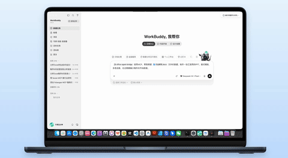
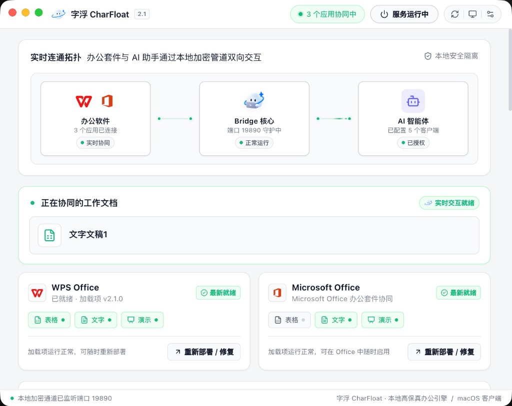
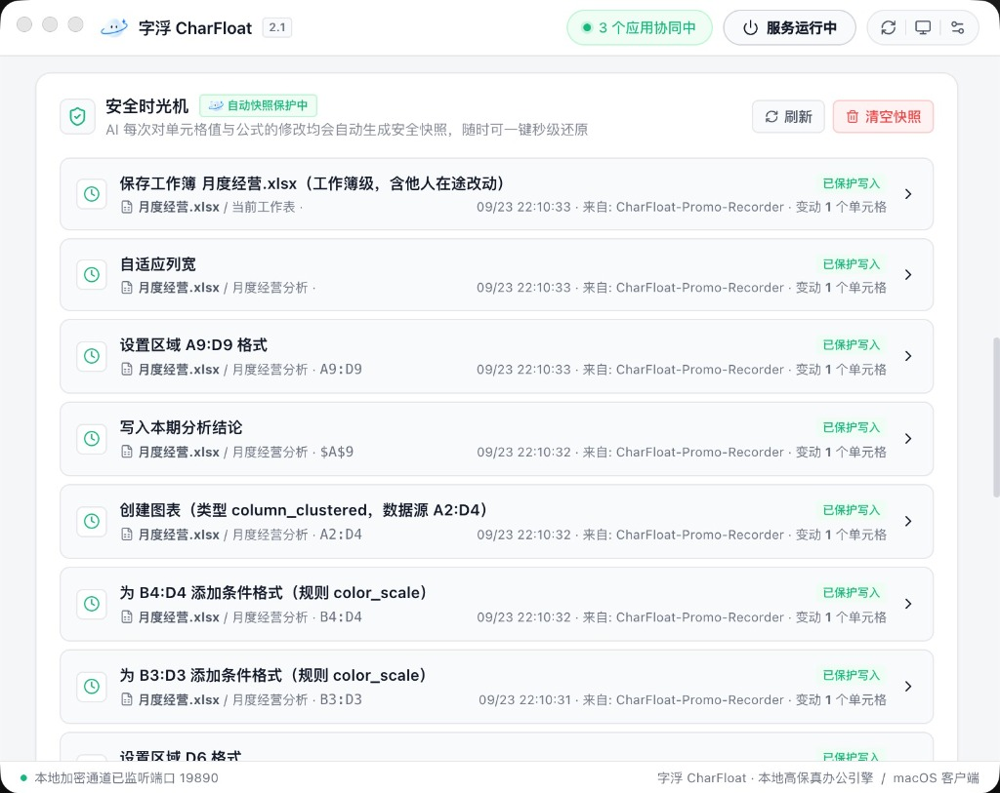
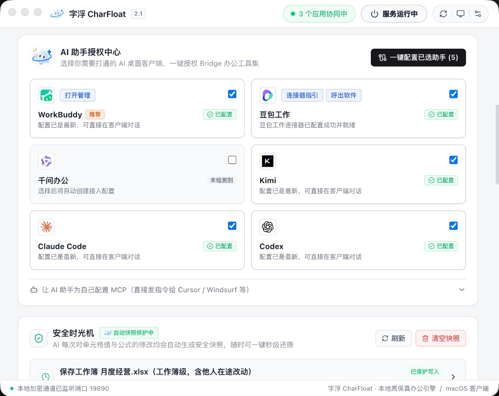
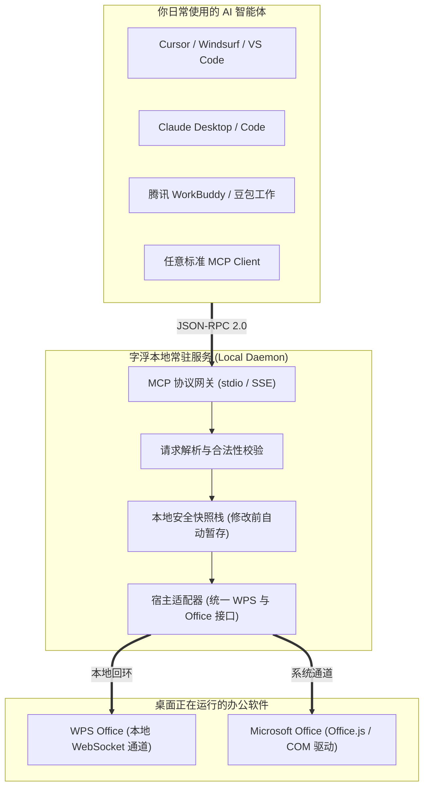

<div align="center">
  
  <h1>字浮 CharFloat</h1>
  <p>给你的 AI 开个 Office 外挂：你说，它当场在你眼前改。</p>
  <p>
    <b>不用反复上传下载</b> · 
    <b>不另存一堆副本</b> · 
    <b>原文档增量修改</b> · 
    <b>改到哪儿看到哪儿</b>
  </p>
  <p><em>不管是 Claude、Cursor、WorkBuddy、豆包还是千问，装上字浮，让它们直接伸手进你当前开着的 WPS 与 Excel 里干活。</em></p>
</div>

<p align="center">
  <a href="https://charfloat.online/"></a>
  <a href="LICENSE"></a>
  <a href="package.json"></a>
  <a href="package.json"></a>
  <a href="package.json"></a>
  <a href="package.json"></a>
  
</p>

<p align="center">
  <a href="https://charfloat.online/">
    
  </a>
  <br />
  <sub>🎬 <strong>交互演示</strong>：直接让 AI 读当前工作表、补齐数据、条件标色并绘制原生图表</sub>
</p>

<p align="center">
  🌐 <strong>个人官网 / 在线主页</strong>：<a href="https://charfloat.online/">https://charfloat.online/</a>
</p>

---

## 为什么写这个小工具？

平时用 AI 处理表格，最让人抓狂的往往不是 AI 理解不了需求，而是**交互路径太痛苦了**：

1. **反复倒腾文件**：把 `.xlsx` 传到网页端，AI 重新生成一份丢给你下载，本地很快堆满了 `数据分析_v1.xlsx` 到 `数据分析_最终不改版_真的最终.xlsx`；
2. **格式公式全丢**：很多工具是用脚本把文件重写了一遍，原表格辛辛苦苦调好的字体、行高、公式联动、条件格式，常常在重新生成后被破坏得一塌糊涂；
3. **黑盒盲猜**：AI 改了哪、算得对不对，你只能等它整个跑完重新打开核对。

我就在想：**为什么不能像人给同事指屏幕一样？**  
“就改当前屏幕上开着的这一份，第 8 行缺的数据给补上，算完公式别动，超标的标个黄。”

**字浮 CharFloat** 就是我为了解决这个痛点自己搓出来的“外挂双手”：纯本地运行、不传云端，通过标准 MCP 协议，让 AI 直连你桌面上正在跑的 WPS / Office，读懂当前活体文档，**指哪改哪，改动当场呈现在眼前**。

---

## 它能帮你做什么？

- **就地修改，不造多余副本**：直接操作你当前打开的工作簿，改完留在原地，原有公式、格式与排版 100% 继承。
- **改到哪儿，看到哪儿**：通过本地长连接与软件进程交互，AI 执行的每一步，你都能在当前窗口实时肉眼看到变化，不用盲猜。
- **原生图表与条件标色**：支持在当前工作表右下角就地画好关联数据源的原生图表，或者按口语化规则柔和标色。
- **本地修改历史与秒级撤回**：每次 AI 动手改单元格前，本地都会预先保留一份快照。万一 AI 算偏了或者你想恢复，随时一键还原，不怕文件被改坏。

<div align="center">
  
  
  
</div>

---

## 平时怎么使？

配好之后，把你常用的 AI 打开，直接跟它讲大白话就行：

- 💬 **增量补数**：“帮我把 8 月数据补齐，按去年的计算口径把同比增长率算出来，原有公式别动。”
- 💬 **条件标色**：“把获客成本超标和转化率未达标的行标出来，不要标红，改成浅黄色。”
- 💬 **就地画图**：“根据 6 到 8 月的月度营收数据画一张折线图，放在表格右下方。”
- 💬 **跨表对齐**：“以员工工号为索引，把 Sheet2 的绩效评分匹配回写到主表的 F 列。”
- 💬 **还原撤销**：“刚才那步格式调整撤回，恢复刚才的初态，这个我自己来调。”

---

## 常用 AI 客户端搭配体验

通过标准的 MCP 协议接入，主流支持 MCP 的 AI 工具基本都能直接挂载：

- **WPS Office ➕ 腾讯 WorkBuddy**：我日常实测下来丝滑度最高的一套组合。WorkBuddy 体验流畅，结合 WPS 的本地长连接通道，响应非常迅捷。
- **Claude Code / Desktop**：Anthropic 官方对 MCP 支持最原生，代码级精细控制非常稳。
- **Cursor / Windsurf / VS Code**：写代码或做数据分析工程时，让编辑器的 Agent 直接调 MCP 改表格非常省心。
- **豆包 / 通义千问 / Kimi**：国内常用的桌面工作台或支持 MCP 的版本，均可直接识别并挂载。

---

## 核心实现原理

字浮的设计很轻量，核心逻辑在本地回环通道中闭环，没有任何外部服务器参与中转：


```mermaid
flowchart TD
    subgraph Agent [" 你日常使用的 AI 智能体 "]
        A1["Cursor / Windsurf / VS Code"]
        A2["Claude Desktop / Code"]
        A3["腾讯 WorkBuddy / 豆包工作"]
        A4["任意标准 MCP Client"]
    end

    subgraph Bridge [" 字浮本地常驻服务 (Local Daemon) "]
        MCP["MCP 协议网关 (stdio / SSE)"]
        Router["请求解析与合法性校验"]
        Snapshot["本地安全快照栈 (修改前自动暂存)"]
        Adapter["宿主适配器 (统一 WPS 与 Office 接口)"]
        
        MCP --> Router --> Snapshot --> Adapter
    end

    subgraph Host [" 桌面正在运行的办公软件 "]
        WPS["WPS Office (本地 WebSocket 通道)"]
        MSO["Microsoft Office (Office.js / COM 驱动)"]
    end

    Agent ==>|JSON-RPC 2.0| MCP
    Adapter ==>|本地回环| WPS
    Adapter ==>|系统通道| MSO
```

1. **协议层**：AI 客户端通过本地 stdio 或 SSE 向字浮发送标准 MCP 工具请求；
2. **快照层**：在真正执行写入前，先读取目标区域当前数据存入本地历史栈；
3. **适配层**：将统一的读写指令转化为 WPS 或 Office 的本地 API；
4. **宿主执行**：修改当场呈现在你眼前的活体文档里。

---

## 平台与软件支持

已在 **Windows** 与 **macOS** 经过实测：

| 平台与宿主 | 支持能力 | 实测情况 |
|---|---|---|
| **Windows WPS** | 表格精准就地修改、Word / PPT 自动化与侧栏支持 | 完整支持，日常主推 |
| **Windows Microsoft Office** | Excel 结构化表格自动化（COM 原生驱动与加载项双通道） | 完整支持 |
| **macOS WPS** | 表格精准就地修改、Word / PPT 基础操作 | 完整支持 |
| **macOS Microsoft Office** | JXA 原生脚本通道 | 基础支持，持续完善中 |

---

## 快速上手

### 方式一：下载桌面端（最省心）

直接运行桌面客户端，它会自动帮你一键安装 WPS / Office 的本地插件，并提供可视化拓扑和快照回滚面板。

- **macOS**：支持 macOS 12+（Apple Silicon M 系列及 Intel）
- **Windows**：支持 Windows 10 / 11 64 位

> 💡 提示：WPS 安装后可从“开始”功能区打开“字浮侧栏”，收起侧栏不影响后台连接；Office 首次打开需要启动一次加载项。详见[插件后台运行说明](docs/addon-background.md)。

### 方式二：让你的 AI 自己把配置加上

如果你正在用 Cursor、Windsurf、VS Code 或 Claude Code，直接把下面这句话发给它，让它自己搞定：

```text
请帮我把「字浮 CharFloat」配置为你的 MCP 扩展工具，让我可以直接操控本地 WPS 与 Office。

MCP 服务配置信息如下：
服务名称: charfloat
启动配置: 使用字浮桌面客户端「AI 助手接入」中复制的本机 MCP 配置（包含实际启动命令、参数和环境变量）

请先读取我提供的本机 MCP 配置，再识别当前客户端，将 charfloat 条目安全合并到 MCP 配置文件中并激活，保留其他服务。若尚未提供本机配置，请提醒我从字浮客户端复制，不要猜测安装路径或从 npm 下载。
```

### 方式三：开发者从源码运行

如果你喜欢纯命令行折腾：

```sh
# 1. 安装依赖并构建
npm ci
npm run build

# 2. 安装本地加载项（会配置本机 WPS/Office 环境）
npm run setup -- --addon

# 3. 常用服务管理
node dist/bridge/cli.cjs --start          # 后台常驻运行
node dist/bridge/cli.cjs --status         # 查看连接状态
node dist/bridge/cli.cjs --doctor         # 运行环境诊断
node dist/bridge/cli.cjs --repair-addon    # 一键修复加载项
node dist/bridge/cli.cjs --stop           # 停止服务
```

> 无参数直接执行 `node dist/bridge/cli.cjs` 即作为标准的 **stdio MCP Server** 运行。

---

## 参与开发与模块指引

本项目代码遵循模块化规范，详细内部说明可查阅 [AGENTS.md](AGENTS.md)：
- **MCP 路由与工具定义**：[src/bridge/AGENTS.md](src/bridge/AGENTS.md)
- **WPS 加载项**：[wps-addon/AGENTS.md](wps-addon/AGENTS.md)
- **Office.js 插件**：[office-addon/AGENTS.md](office-addon/AGENTS.md)
- **配套 Agent 技能**：[skills/charfloat/SKILL.md](skills/charfloat/SKILL.md)
- **官网主页工程**：[website/AGENTS.md](website/AGENTS.md)（在线访问：[charfloat.online](https://charfloat.online/)）

欢迎提 Issue、交流折腾心得，或者一起提 PR 改进！

---

## 许可证 (License)

本项目采用 [MIT License](LICENSE) 开源。
